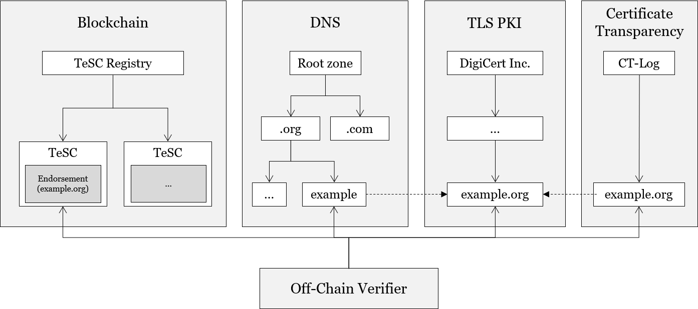

# TeSC: TLS/SSL-Certificate Endorsed Smart Contracts
> IEEE DAPPS 2021
> The 3<sup>rd</sup> IEEE International Conference on Decentralized Applications and Infrastructures

Ulrich Gallersdörfer<sup>1</sup> and Florian Matthes<sup>1</sup>

<sup>1</sup> Technical University Munich, Munich, Germany
{[ulrich.gallersdoerfer](mailto:ulrich.gallersdoerfer@tum.de),[matthes](mailto:matthes@tum.de)}@tum.de

## Abstract
> Although nearly all information regarding smart contract addresses is shared via websites, emails, or other forms of digital communication, blockchains and distributed ledger technologies are unable to establish secure bindings between websites and the corresponding smart contracts. A user cannot differentiate between a website link to a legitimate smart contract set up by a reputable business owner and that to an illicit contract aiming to defraud the user. Surprisingly, current attempts to resolve this issue are based mostly on information redundancy, e.g., displaying contract addresses multiple times in varying forms of images and text. These verification processes are burdensome because the user is responsible for verifying the accuracy of an address. More importantly, these measures do not address the core problem because the contract itself does not contain information on its authenticity. To resolve such limitations and to increase security, we propose a solution that leverages publicly issued Transport Layer Security (TLS)/Secure Sockets Layer (SSL) certificates of Fully-Qualified Domain Names (FQDN) to ensure the authenticity of smart contracts and their owners. Our approach combines on-chain endorsement storage that utilizes signatures from the respective certificate and off-chain authentication of the smart contract. The system is open and transparent because the only requirement for usage is ownership of a TLS/SSL certificate. Further, moderate deployment and maintenance costs, a widely accepted public key infrastructure, and a simple interface enable TLS/SSL endorsed smart contracts (TeSC) to bridge the gap between websites and smart contracts.

## Presentation & Slides
TBD

## Overview


## Interface

```javascript
pragma solidity ^0.7.0;

interface ERCXXX /* is ERC165 */ {

    // @dev This emits when the Domain of the endorsement changes by any mechanism
    event DomainChanged(string domain);
    
    // @dev This emits when the Expriy Date of the endorsement changes by any mechanism
    event ExpiryChanged(uint64 expiry);
    
    // @dev This emits when the Flags of the endorsement changes by any mechanism
    event FlagsChanged(bytes24 flags);
    
    // @dev This emits when the Signature of the endorsement changes by any mechanism
    // Signature signed the claim {addr|domain|expiry|flags}
    event SignatureChanged(string signature);
    
    // @dev This emits when the certificate-fingerprint of the endorsement changes by any mechanism
    event FingerprintChanged(bytes32 fingerprint);

    // @dev This enum specifies whether an array-element was added or removed
    enum EventType {Add, Remove}
    
    // @dev This emits when an address was added or removed from the subendorsements
    event SubendorsementsChanged(address indexed contractAddr, EventType eventType);
    
    // @notice Returns the domain for the given Smart Contract
    // @dev The domain is a fully-qualified domain name (e.g. "domain.example.org")
    // @return The domain of the contract
    function getDomain() external view returns (string memory);

    // @notice Returns the expiry of the endorsement
    // @dev The timestamp is given in seconds since the epoch
    // @return The expiry of the contract
    function getExpiry() external view returns (uint64);

    // @notice Returns the flags as bytes24
    // @return The flags as bytes
    function getFlags() external view returns (bytes24);

    // @notice Returns the signature for the given Smart Contract
    // @dev The signature contains the claim {addr|domain|expiry|flags} and is signed with the private key from the certificate
    // @return The signature of the contract
    function getSignature() external view returns (string memory);
    
    // @notice Returns the sha256-fingerprint of the certificate that was used to sign the claim
    // @return The certificate fingerprint of the contract
    function getFingerprint() external view returns (bytes32);

    // @notice Returns subendorsements
    // @return The array of subendorsed contract addresses
    function getSubendorsements() external view returns (address[] memory);
}
```

## Flags
Flags enable additional functionality or restrictions in handling an endorsement. We display a list of all available flags and reasoning. In the smart contracts, we store flags in a `bytes24` variable. This allows us to store up to 192 flags, addressing them from `f<sub>1</sub>` to `f<sub>191</sub>` . Each flag can be set either to *true* or *false*, resulting in `f<sub>i</sub> = {0,1}`.

`f<sub>0</sub>` **SANITY**: The sanity flag is always set to 1 to check if the flag variable is uninitialized or if all flags are actually set intentionally to 0.
`f<sub>1</sub>` **DOMAIN\_HASHED**: This flag is set if a domain is stored as a hash for privacy reasons. The hash is constructed as $h = hash(domain)$. This flag is set if an owner does not want the smart contract to be easily attributed to the domain by crawling the blockchain. We rely on \texttt{keccak256} as hash function.
`f<sub>2</sub>` **ALLOW\_SUBENDORSEMENT**: This flag is set if a smart contract is able to endorse further addresses such as contracts or externally owned accounts. The referenced smart contracts are stored in an array of the respective endorsing smart contract. If this flag is not set, the verification of the subendorsements fails.
`f<sub>3</sub>` **EXCLUSIVE**: If this flag is set, one contract equipped with a valid endorsement can exist; if multiples exist, no contract is considered to be valid as long as the owner resolves the issues by either invalidating the endorsements, or removing the EXCLUSIVE flag from the contracts.
`f<sub>4</sub>` **PAYABLE**: If a domain owner wants to allow users to send funds to the domain (owner), the owner sets this flag to let users know that this contract accepts funds.
`f<sub>5</sub>` **ALLOW\_SUBDOMAIN**: If this flag is set, smart contract addresses that are displayed in a subdomain context (the smart contract only being endorsed by the regular domain) can be verified. This is similar to a wildcard in TLS certificates and requires the certificate being issued for the respective domain.
`f<sub>6</sub>` **TRUST\_AFTER\_EXPIRY**: Data that has been entered while the endorsement was valid can still be considered as valid after the endorsement or the TLS certificate expires. Because this information is time-stamped and no one can add or modify the data (without being noticed), the data is considered to be valid if this flag is set. This flag is especially useful for cases in which the blockchain is used to store data for public verification.
`f<sub>7</sub>` **STRICT**: If this flag is set, the certificate returned via the web server must be identical to the certificate that signed the endorsement; otherwise, the verification fails.
%`f<sub>8</sub>` **EVENT\_DATA\_ONLY**: The data of the endorsement itself is not stored on-chain, but resides in the event logs. This significantly reduces the costs of the endorsement.
`f<sub>x</sub>` **reserved**: All other flags are reserved.


## Contract Source Codes

In the folder `contracts` you find all contracts:
- [`ERC165.sol`](contracts/ERC165.sol): Interface for ERC165
- [`TeSC.sol`](contracts/TeSC.sol): Interface for TeSC
- [`TeSCImplementation.sol`](contracts/TeSCImplementation.sol): Reference Implementation for TeSC
- [`TeSCRegistry.sol`](contracts/TeSCRegistry.sol): Interface for TeSC Registry
- [`TeSCRegistryImplementation.sol`](contracts/TeSCRegistryImplementation.sol): Reference Implementation for TeSC Registry